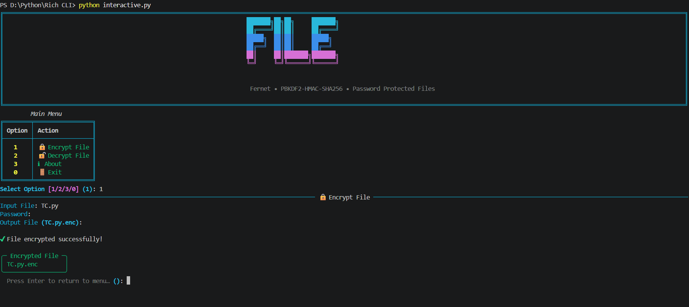
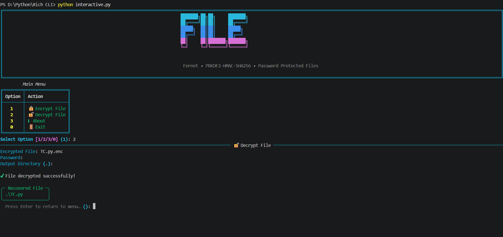
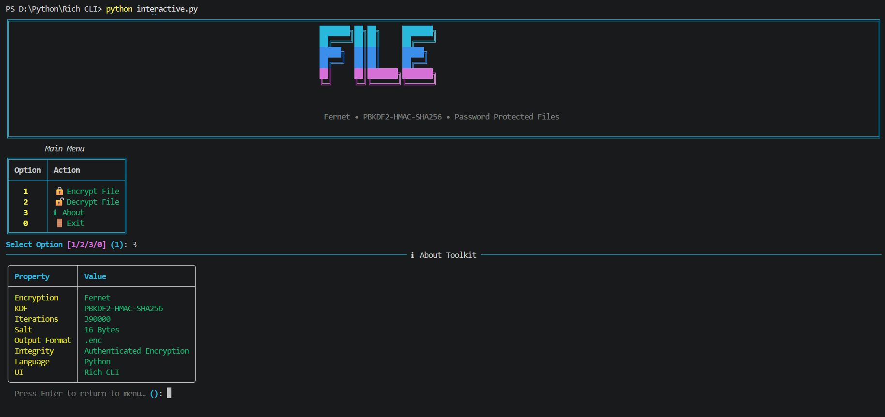
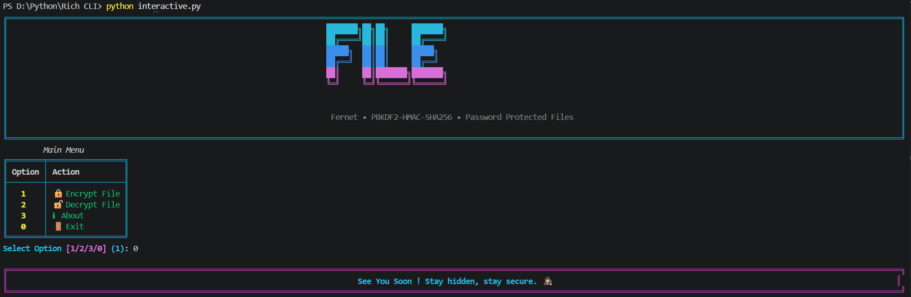

# 🔐 File-Encryption-CLI-Tool

A Python-based **File Encryption Command Line Tool** that allows users to **securely encrypt any file** using a password and later **decrypt it back to its original form** via terminal commands.
This project uses **Fernet symmetric encryption** with **PBKDF2-HMAC key derivation**, designed for **automation**, **scripting**, **and security learning purposes.**

---

## 🧱 Project Structure

```bash
File-Encryption-CLI-Tool/
│
├── assets/             # Screenshots
├── main.py             # Main CLI application
├── interactive.py      # Rich CLI Version
├── requirements.txt    # Project Dependancies
└── README.md           # Project documentation
```

---

## ✨ Features

## 🔐 File Encryption
- Encrypts **any file type** (video, image, audio, documents, binaries,etc.)
- Uses **Fernet (AES-128 authenticated encryption)**
- Password-based key derivation using **PBKDF2-HMAC (SHA256, 390,000 iterations)**
- Generates a secure encrypted file with `.enc` extension
- Stores metadata safely using a **MAGIC header**

## 🔓 File Decryption
- Decrypts `.enc` encrypted files back to original format
- Restores the **original file name and content**
- Detects invalid or corrupted encrypted files
- Protects against wrong password usage

## 🖥 CLI Highlights
- Clean and simple **argparse-based CLI**
- Separate commands for **Encryption and Decryption**
- Supports custom output paths
- Password-protected operations
- Script-friendly & automation-ready
- Works on **all platforms** (Windows / Linux / macOS)
- **Supports all file formats**

### 🎨 Rich CLI Interface
- Colored terminal output
- Structured key display tables
- Styled panels for encoding/decoding results
- Better user experience and readability

### ⚡ Dual Mode Support
- 🧼 Basic CLI → Lightweight, no dependencies
- 🎨 Rich CLI → Enhanced UI with colors and panels

---

## 🛠 Technologies Used

| Technology                             | Role                        |
| -------------------------------------- | --------------------------- |
| **Python 3**                           | Core language               |
| **argparse**                           | Command-line parsing        |
| **cryptography (Fernet + PBKDF2HMAC)** | Encryption & key derivation |
| **secrets**                            | Secure salt generation      |
| **base64 / os**                        | Binary & file handling      |
| **Rich**                               | Interactive CLI interface   |

---


## ▶️ How to Run

### 1️⃣ Clone the repository

```bash
git clone https://github.com/ShakalBhau0001/File-Encryption-CLI-Tool.git
```

### 2️⃣ Enter the project directory

```bash
cd File-Encryption-CLI-Tool
```

### 3️⃣ Install Dependencies

```bash
pip install rich cryptography
```

**OR**

```bash
pip install -r requirements.txt
```

### 4️⃣ Running the Project

#### Basic CLI Version

```bash
python main.py
```

#### Rich Interactive Version

```bash
python interactive.py
```

---

## ▶️ Usage

### 🔐 Encrypt a File

``` bash
python main.py encrypt --input secret.pdf --password myStrongPass
```

```bash
python main.py encrypt --input secret.pdf --password myStrongPass --output secret.enc
```

### 🔓 Decrypt a File

``` bash
python main.py decrypt --input secret.pdf.enc --password myStrongPass
```

```bash
python main.py decrypt --input secret.pdf.enc --password myStrongPass --output ./output_folder
```

---

## 📁 Supported File Format

- **Input:** Any file type
- **Encrypted Output:** `.enc`
- **Decrypted Output:** Original file format restored

> ⚠️ Encrypted files without a valid MAGIC header will be rejected.

---

## ⚙️ How It Works

**1️⃣ Key Derivation**

- Password → PBKDF2-HMAC(SHA256, 390,000 iterations) → 32-byte key → Fernet key

**2️⃣ Encryption**

- File data encrypted using Fernet
- Encrypted file structure:
    ```bash
    [FILE][16-byte salt][filename length][original filename][encrypted data]
    ```

**3️⃣ Decryption**

- Validates MAGIC header
- Extracts salt & filename
- Re-derives encryption key
- Decrypts file back to original format

---

## ⚠️ Common Errors

- **Wrong password** → Decryption fails
- **Invalid file** → MAGIC header missing
- **Corrupted file** → Decryption error
- **Renamed `.enc` file** → Still works (metadata stored internally)

---

## 🌟 Future Enhancements

- File integrity hash verification
- Folder encryption support
- Progress indicator for large files
- Cross-platform executable build

---

## 📦 Extended Version

This repository focuses on a **specific steganography technique** implemented
as a **command-line (CLI) learning project**.

The goal of this project is to:
- Understand how steganography works at a practical level  
- Experiment with data hiding techniques  
- Learn how CLI-based security tools are structured  

For a **more advanced and combined implementation** that includes:
- Image steganography  
- Audio steganography  
- File encryption support  

please refer to:

🔗 **[StegaVault-CLI](https://github.com/ShakalBhau0001/StegaVault-CLI)**

---

## ⚠️ Disclaimer

This project is intended for **educational and research purposes only**.

It is **not designed for real-world secure communication**.
Steganography alone does not guarantee secrecy and should not be considered
a replacement for proper cryptographic security.

---

## 📸 Preview

### 1. **Encryption**



### 2. **Decryption**



### 3. **Info**



### 4. **Exit**



---

## 🪪 Author

> **Creator: Shakal Bhau**

> **GitHub: [ShakalBhau0001](https://github.com/ShakalBhau0001)**

---

## ⭐ Support

If you like this project, consider giving it a ⭐ on GitHub!

---
